# PYAS

Antivirus software written in Python and C++ that blocks threats through deep learning and behavioral monitoring!


## Requirements

Python 3.10 is recommended. Other Python versions may require different pip commands.

```
pip install requests==2.32.4
pip install PySide6==6.9.1
pip install yara-python==4.5.4
pip install Pillow==11.0.0
pip install numpy==1.26.4
pip install tensorflow==2.10.0
pip install tf2onnx==1.13.0
pip install onnxruntime==1.18.1
```

## File Information

The following lists the storage locations of all relevant code and other related documents.

```
PYAS/
├── Engine/
│   ├── Models/
│   │   ├── convert.py               # Convert executable files or other files to images
│   │   ├── train.py                 # TensorFlow CNN model training complete code
│   │   └── ...                      # Other models folders and files
│   │
│   └── Rules/
│       ├── rules.yar                # Yara virus signature rule matching
│       ├── rules.ips                # IP network address rule matching
│       └── ...                      # Other rules folders and files
│
├── Plugins/
│   └── Filter/
│       ├── DriverEntry.cpp          # Main driver entry and initialization logic
│       ├── DriverCommon.h           # Global driver definitions, constants, and functions
│       ├── ProtectBoot.cpp          # Disk boot sector write protection
│       ├── ProtectRegistry.cpp      # Registry modification protection
│       ├── ProtectRules.cpp         # White, block list, and matching logic for files registry
│       └── ...                      # Other driver folders and files
│
├── PYAS.py                          # Main application entry point and UI to engine interface
├── PYAS_Config.py                   # Configuration loading, saving, and global parameters
├── PYAS_Engine.py                   # Core scanning engine: YARA, IP, ONNX model execution
├── PYAS_Interface.py                # User interface components and event handling
├── PYAS_Resource.py                 # Static image and icon resource management
├── PYAS_Version.py                  # Version metadata for packaging and updates
└── ...                              # Other supplementary folders and files
```

## Architecture diagram

PYAS Security antivirus software general architecture diagram.

```mermaid
graph TD
    %% Global Styles
    classDef ui fill:#e1f5fe,stroke:#01579b,stroke-width:2px;
    classDef logic fill:#fff9c4,stroke:#fbc02d,stroke-width:2px;
    classDef engine fill:#e8f5e9,stroke:#2e7d32,stroke-width:2px;
    classDef thread fill:#f3e5f5,stroke:#7b1fa2,stroke-width:2px;
    classDef kernel fill:#ffebee,stroke:#c62828,stroke-width:2px;
    classDef data fill:#eceff1,stroke:#455a64,stroke-width:2px,stroke-dasharray: 5 5;

    User((User))

    subgraph Presentation_Layer ["Presentation Layer (View)"]
        direction TB
        UI_Static["PYAS_Interface.py<br/>(Ui_main_window Class)"]:::ui
        UI_Controller["PYAS.py<br/>(MainWindow_Controller Class)"]:::ui
        TrayIcon["System Tray Icon"]:::ui
        
        User <--> UI_Controller
        UI_Static --- UI_Controller
        UI_Controller --- TrayIcon
    end

    subgraph Core_Logic_Layer ["Core Logic & Controller"]
        direction TB
        Init_Env["Initialization<br/>(init_environ, init_variable,<br/>init_windll)"]:::logic
        Config_Mgr["Configuration Manager<br/>(load_config, save_config)"]:::logic
        
        subgraph System_Tools ["System Tools"]
            Sys_Repair["System Repair<br/>(repair_system_mbr,<br/>repair_system_image, etc.)"]:::logic
            Sys_Clean["System Cleaner<br/>(clean_button, traverse_temp)"]:::logic
            Proc_Mgr["Process Manager<br/>(list_process, kill_process)"]:::logic
            List_Mgr["List Manager<br/>(manage_named_list:<br/>Whitelist/Quarantine)"]:::logic
        end

        UI_Controller --> Init_Env
        Init_Env --> Config_Mgr
        UI_Controller --> System_Tools
    end

    subgraph Protection_Layer ["Real-time Protection Threads (Daemons)"]
        direction TB
        Thread_Proc["Process Guard Thread<br/>(protect_proc_thread)<br/>[WMI/Snapshot]"]:::thread
        Thread_File["File Guard Thread<br/>(protect_file_thread)<br/>[ReadDirectoryChangesW]"]:::thread
        Thread_Net["Network Guard Thread<br/>(protect_net_thread)<br/>[GetExtendedTcpTable]"]:::thread
        Thread_Sys["System Guard Thread<br/>(protect_system_thread)<br/>[Reg/MBR Check]"]:::thread
        Thread_Popup["Popup Blocker Thread<br/>(popup_intercept_thread)<br/>[EnumWindows]"]:::thread
        Thread_Pipe["Driver IPC Thread<br/>(pipe_server_thread)<br/>[NamedPipe Server]"]:::thread

        Init_Env --> Thread_Proc
        Init_Env --> Thread_File
        Init_Env --> Thread_Net
        Init_Env --> Thread_Sys
        Init_Env --> Thread_Popup
        Init_Env --> Thread_Pipe
    end

    subgraph Engine_Layer ["Detection Engine (PYAS_Engine.py)"]
        direction TB
        Scan_Worker["Scan Worker<br/>(scan_worker / scan_engine)"]:::engine
        
        subgraph Scanners
            Sign_Check["Signature Scanner<br/>(sign_scanner)<br/>[WinVerifyTrust]"]:::engine
            AI_Model["AI Model Scanner<br/>(model_scanner)<br/>[ONNX/ResNet]"]:::engine
            Yara_Rules["Rule Scanner<br/>(rule_scanner)<br/>[Yara/IP Lists]"]:::engine
        end

        Thread_Proc --> Scan_Worker
        Thread_File --> Scan_Worker
        Thread_Net --> Scan_Worker
        UI_Controller -->|Manual Scan| Scan_Worker

        Scan_Worker --> Sign_Check
        Scan_Worker --> AI_Model
        Scan_Worker --> Yara_Rules
    end

    subgraph Kernel_OS_Layer ["Windows Kernel & Driver"]
        direction TB
        WinAPI["Windows API (ctypes)<br/>(kernel32, user32, ntdll,<br/>advapi32, iphlpapi, psapi)"]:::kernel
        Driver_Sys["Kernel Driver<br/>(PYAS_Driver.sys)"]:::kernel
        OS_FS["File System (NTFS)"]:::kernel
        OS_Net["Network Stack"]:::kernel

        Init_Env -- Load DLLs --> WinAPI
        Thread_File -- Monitor --> OS_FS
        Thread_Net -- Monitor --> OS_Net
        Thread_Proc -- Suspend/Kill --> WinAPI
        
        Thread_Pipe <==>|"Named Pipe IPC<br/>(\\.\pipe\PYAS_Output_Pipe)"| Driver_Sys
        Driver_Sys -- Callback/Block --> WinAPI
    end

    subgraph Data_Persistence ["Data & Resources"]
        Config_File[("Config.json")]:::data
        Model_Files[("Model Files<br/>(.onnx)")]:::data
        Rule_Files[("Rule Files<br/>(.yar)")]:::data
        Quarantine_Dir[("/Quarantine/")]:::data

        Config_Mgr <--> Config_File
        AI_Model <--> Model_Files
        Yara_Rules <--> Rule_Files
        List_Mgr <--> Quarantine_Dir
    end
```



## Support System

| Config    | Permissions   | System version       | Processor | Memory | Storage |
|-----------|---------------|----------------------|-----------|--------|---------|
| Minimum   | Administrator | >= Windows 10 (20H1) | 1 GHz     | 200MB  | 100MB   |
| Recommend | Administrator | >= Windows 10 (21H2) | 3 GHz     | 500MB  | 200MB   |

## Packaged Releases

Download the installer. If it is incompatible with your system, you can repackage it yourself.

Packaged Download: https://github.com/87owo/PYAS/releases

## Official Website

If you are interested in this project, you can visit the website to see other related content.

Source Available : https://github.com/87owo/PYAS

Official Website : https://pyas-security.com/antivirus

## Project License

For any questions, needs, or bug feedback, please contact us through the following website.

Source Issues : https://github.com/87owo/PYAS/issues

Official Email : mailto:service.pyas@gmail.com
