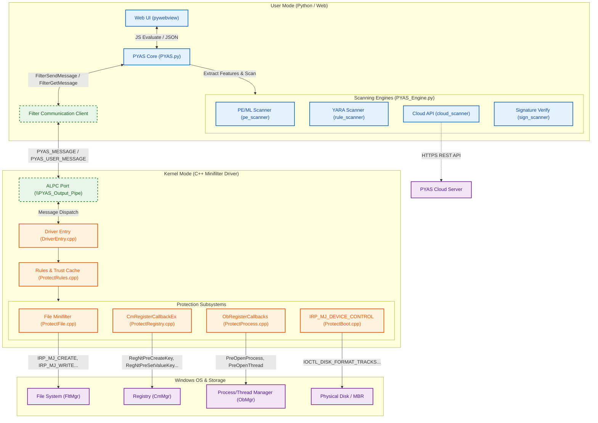

# PYAS Security

Antivirus software written in Python and C++ that blocks threats through Machine Learning and behavioral monitoring!


## Requirements

Python 3.10 is recommended. Other Python versions may require different pip commands.

```
pip install pystray
pip install pefile
pip install requests
pip install pywebview
pip install Pillow
pip install yara-python
pip install numpy
pip install onnxruntime
```

Non-essential requirements installation, only used for model training or other functions.

```
pip install pandas
pip install scikit-learn
pip install lightgbm
pip install onnxmltools
pip install orjson
```

## File Information

The following lists the storage locations of all relevant code and other related documents.

```
PYAS/
├── Engine/                          # Complete code for Yara signatures and AI model training
│   ├── Heuristic/
│   │   └── ...                      # Yara Rules
│   └── Properties/
│       └── ...                      # LightGBM Model
│
├── Interface/                       # Interface Interaction and Icons with WebView2
│   ├── static/
│   │   └── ...                      # style.css, main.js, icon.ico
│   └── templates/
│       └── ...                      # index.html
│
├── Plugins/                         # Main filter driver protect and rules
│   ├── Filter/
│   │   └── ...                      # DriverCommon.h, DriverEntry.cpp, ProtectRegistry.cpp, ...
│   └── Rules/
│       └── ...                      # Rules_Driver_P1.json
|
├── PYAS.py                          # Main antivirus application entry point
├── PYAS_Engine.py                   # Core scanning engine algorithm
├── PYAS_Version.py                  # Version metadata for packaging and updates
└── ...
```

## Architecture diagram

PYAS Security antivirus software general architecture diagram.


```mermaid
graph TD
    %% Global Styles
    classDef userMode fill:#e3f2fd,stroke:#1565c0,stroke-width:2px,color:#0d47a1
    classDef kernelMode fill:#fff3e0,stroke:#e65100,stroke-width:2px,color:#e65100
    classDef storage fill:#f3e5f5,stroke:#7b1fa2,stroke-width:2px,color:#4a148c
    classDef interaction fill:#e8f5e9,stroke:#2e7d32,stroke-width:2px,stroke-dasharray: 5 5,color:#1b5e20

    subgraph UserMode ["User Mode (Python / Web)"]
        UI["Web UI (pywebview)"]:::userMode
        PYASCore["PYAS Core (PYAS.py)"]:::userMode
        
        subgraph Engines ["Scanning Engines (PYAS_Engine.py)"]
            PEScanner["PE/ML Scanner (pe_scanner)"]:::userMode
            RuleScanner["YARA Scanner (rule_scanner)"]:::userMode
            CloudScanner["Cloud API (cloud_scanner)"]:::userMode
            SignScanner["Signature Verify (sign_scanner)"]:::userMode
        end
        
        CommClient["Filter Communication Client"]:::interaction
    end

    subgraph KernelMode ["Kernel Mode (C++ Minifilter Driver)"]
        CommServer["ALPC Port (\\PYAS_Output_Pipe)"]:::interaction
        DriverCore["Driver Entry (DriverEntry.cpp)"]:::kernelMode
        RuleEngine["Rules & Trust Cache (ProtectRules.cpp)"]:::kernelMode

        subgraph Protections ["Protection Subsystems"]
            FileProtect["File Minifilter (ProtectFile.cpp)"]:::kernelMode
            ProcessProtect["ObRegisterCallbacks (ProtectProcess.cpp)"]:::kernelMode
            RegProtect["CmRegisterCallbackEx (ProtectRegistry.cpp)"]:::kernelMode
            BootProtect["IRP_MJ_DEVICE_CONTROL (ProtectBoot.cpp)"]:::kernelMode
        end
    end

    subgraph OS ["Windows OS & Storage"]
        FS["File System (FltMgr)"]:::storage
        Reg["Registry (CmMgr)"]:::storage
        ProcMgr["Process/Thread Manager (ObMgr)"]:::storage
        Disk["Physical Disk / MBR"]:::storage
    end

    CloudAPI["PYAS Cloud Server"]:::storage

    %% User Mode Internal
    UI <-->|JS Evaluate / JSON| PYASCore
    PYASCore -->|Extract Features & Scan| Engines
    CloudScanner -.->|HTTPS REST API| CloudAPI
    PYASCore <-->|FilterSendMessage / FilterGetMessage| CommClient

    %% User-Kernel Boundary
    CommClient <-->|PYAS_MESSAGE / PYAS_USER_MESSAGE| CommServer

    %% Kernel Mode Internal
    CommServer <-->|Message Dispatch| DriverCore
    DriverCore --> RuleEngine
    RuleEngine --> Protections

    %% Kernel-OS Boundary
    FileProtect -->|IRP_MJ_CREATE, IRP_MJ_WRITE...| FS
    ProcessProtect -->|PreOpenProcess, PreOpenThread| ProcMgr
    RegProtect -->|RegNtPreCreateKey, RegNtPreSetValueKey...| Reg
    BootProtect -->|IOCTL_DISK_FORMAT_TRACKS...| Disk
```

## Machine Learning

The machine learning-based virus scanning engine training achieved extremely high accuracy.


## Support System

Please ensure your computer supports Microsoft Visual C++ 2015-2022 Redistributable and Edge Webview2.

| Config    | Permissions   | System version       | Processor | Memory | Storage |
|-----------|---------------|----------------------|-----------|--------|---------|
| Minimum   | Administrator | >= Windows 10 (20H1) | 1 GHz     | 300MB  | 100MB   |
| Recommend | Administrator | >= Windows 10 (21H2) | 3 GHz     | 500MB  | 200MB   |

## Official Website

If you are interested in this project, you can visit the website to see other related content.

Source Available : https://github.com/87owo/PYAS

Official Website : https://pyas-security.com/antivirus

Online Analyze : https://pyas-security.com/analyze

Packaged Download: https://github.com/87owo/PYAS/releases

## Project License

For any questions, needs, or bug feedback, please contact us through the following website.

Source Issues : https://github.com/87owo/PYAS/issues

Official Email : service@pyas-security.com
