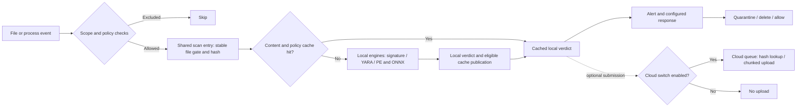
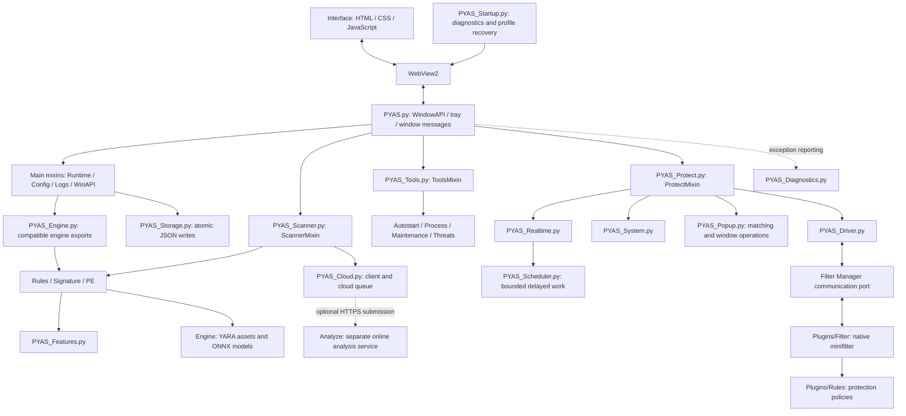

# PYAS Security

<div align="center">

**A hybrid Windows endpoint security platform powered by machine learning, YARA rules, cloud analysis, and kernel-level behavioral protection.**

[](https://github.com/87owo/PYAS/releases/latest)
[](https://github.com/87owo/PYAS/stargazers)
[](https://github.com/87owo/PYAS/network/members)
[](https://github.com/87owo/PYAS)
[](https://www.python.org/)
[](https://github.com/87owo/PYAS/tree/main/Plugins/Filter)

[Website](https://pyas-security.com/antivirus) · [Online Analysis](https://pyas-security.com/analyze) · [Download](https://github.com/87owo/PYAS/releases) · [Report an Issue](https://github.com/87owo/PYAS/issues)

</div>


## Overview

Current desktop source version: **3.7.1** (`PYAS_Version.py`; Windows file version `3.7.1.0`). The source version does not imply that a matching installer has already been published.

PYAS Security is a source-available Windows endpoint security project that combines multiple detection and protection layers in one desktop application. It brings together local PE-file machine-learning inference, YARA-based matching, digital-signature inspection, optional cloud analysis, real-time user-mode monitoring, and a native Windows minifilter driver.

The project is designed both as a usable security application and as an engineering platform for studying malware detection, Windows internals, rule-driven prevention, model training, and online file analysis.

> [!IMPORTANT]
> PYAS is an independent security project. No antivirus product can guarantee detection of every threat. Evaluate it in a controlled environment before production use, keep backups, and review alerts before deleting files.

## Why PYAS

- **Layered detection** — combines YARA, PE feature analysis, ONNX models, signature verification, and cloud-assisted analysis.
- **Behavior-oriented protection** — monitors processes, files, memory, network activity, system settings, and sensitive operations.
- **Kernel integration** — includes a C++ minifilter driver with configurable protection rules and user-mode communication.
- **Local-first scanning** — performs core static analysis on the endpoint; cloud submission is separately configurable.
- **Operational tooling** — adds quarantine, allow/block lists, system repair, startup management, cleanup, and activity reporting.
- **Research-ready codebase** — includes model-training utilities, an online analysis service, an API client, experimental engines, and a visual rule editor.

## Protection capabilities

| Layer | Capability | Implementation |
|---|---|---|
| Static rules | File and process-memory matching | YARA rules compiled and loaded by `rule_scanner` |
| PE machine learning | Feature extraction and local classification | `pefile`, NumPy, ONNX Runtime |
| Signature trust | Authenticode verification | Windows WinVerifyTrust APIs |
| Cloud analysis | Optional queued submission; client methods for polling and rescanning | `PYAS_Cloud.py`, HTTPS and chunked upload |
| Process protection | New-process inspection, optional suspension, termination controls | Win32/NT APIs and worker pools |
| File protection | Directory change monitoring, debounced real-time scans, file locking | Windows file notification APIs |
| Memory protection | Process-memory YARA scanning and kernel callbacks | User-mode scanner plus driver rules |
| Network visibility | Process-aware TCP connection monitoring | Windows IP Helper APIs |
| Kernel enforcement | File, process/thread, registry, memory, image-load, and boot/disk controls | Native C++ minifilter driver |
| Recovery and maintenance | Quarantine, system repair, startup management, cleanup, MBR backup/check | Python application services |

Protection modules are individually configurable. Cloud submission is disabled by default. Several active-protection switches are also disabled by default so users can enable only the controls appropriate for their environment.

## Detection pipeline


```mermaid
flowchart LR
    A[File or process event] --> B{Scope and policy checks}
    B -->|Excluded| Z[Skip]
    B -->|Allowed| C[Shared scan entry: stable file gate and hash]
    C --> D{Content and policy cache hit?}
    D -->|Yes| H[Cached local verdict]
    D -->|No| E[Local engines: signature / YARA / PE and ONNX]
    E --> F[Local verdict and eligible cache publication]
    F --> H
    H --> M[Alert and configured response]
    M --> N[Quarantine / delete / allow]
    H -. optional submission .-> I{Cloud switch enabled?}
    I -->|Yes| J[Cloud queue: hash lookup / chunked upload]
    I -->|No| K[No upload]
```

`PYAS_Scanner.py` coordinates local scanning and remediation. The common scan entry holds a read handle that denies concurrent writes/deletes while hashing and classifying. If the handle cannot be acquired, classification still runs and a retry is scheduled, but the result is not published to the shared cache.

`PYAS_Cloud.py` contains both `CloudScanner` and `CloudQueueMixin`. The desktop cloud worker currently submits files; it does not automatically call `get_result()` or merge a remote verdict into local remediation. Polling and rescan methods remain available to explicit client callers.

## System architecture

The desktop application currently consists of **27 `PYAS*.py` modules**. `WindowAPI` in `PYAS.py` combines `_MainMixin`, `ScannerMixin`, `ToolsMixin`, and `ProtectMixin` on one application instance. The mixins share the existing configuration, state, queues, and locks rather than creating separate service instances.


```mermaid
flowchart TB
    UI[Interface: HTML / CSS / JavaScript] <--> WV[WebView2]
    WV <--> CORE[PYAS.py: WindowAPI / tray / window messages]
    START[PYAS_Startup.py: diagnostics and profile recovery] --> WV
    CORE --> MAIN[Main mixins: Runtime / Config / Logs / WinAPI]
    CORE --> SCAN[PYAS_Scanner.py: ScannerMixin]
    CORE --> TOOLS[PYAS_Tools.py: ToolsMixin]
    CORE --> PROTECT[PYAS_Protect.py: ProtectMixin]

    MAIN --> ENGINE[PYAS_Engine.py: compatible engine exports]
    SCAN --> LOCAL[Rules / Signature / PE]
    ENGINE --> LOCAL
    LOCAL --> FEATURES[PYAS_Features.py]
    LOCAL --> ASSETS[Engine: YARA assets and ONNX models]
    SCAN --> CLOUD[PYAS_Cloud.py: client and cloud queue]
    CLOUD -. optional HTTPS submission .-> ONLINE[Analyze: separate online analysis service]

    TOOLS --> UTIL[Autostart / Process / Maintenance / Threats]
    PROTECT --> RT[PYAS_Realtime.py]
    PROTECT --> SYS[PYAS_System.py]
    PROTECT --> POP[PYAS_Popup.py: matching and window operations]
    PROTECT --> DRIVER[PYAS_Driver.py]
    RT --> SCHED[PYAS_Scheduler.py: bounded delayed work]
    DRIVER <--> PORT[Filter Manager communication port]
    PORT <--> KERNEL[Plugins/Filter: native minifilter]
    KERNEL --> POLICY[Plugins/Rules: protection policies]

    MAIN --> STORE[PYAS_Storage.py: atomic JSON writes]
    CORE -. exception reporting .-> DIAG[PYAS_Diagnostics.py]
```

- **Application state:** `PYAS_Runtime.py` owns initialization, UI dispatch, and feature-worker lifecycle. `PYAS_Config.py` applies switches and persists settings after successful operations; failures restore the prior state and attempt the corresponding rollback. Driver disable state is committed only after unloading succeeds.
- **Protection:** `PYAS_Realtime.py` handles process, file, and network monitoring; `PYAS_System.py` handles system protection and repair; `PYAS_Driver.py` owns driver lifecycle and communication; `PYAS_Popup.py` combines popup matching with native window operations.
- **Shared infrastructure:** `PYAS_Process.py` centralizes process enumeration and operations; `PYAS_WinAPI.py` centralizes Win32/NT declarations, native structures, and file-notification decoding. `PYAS_Scheduler.py` uses one scheduler and at most four workers, with a default 2048 pending-work limit, bounded critical retry capacity, and recovery scans on overflow.
- **Storage and diagnostics:** configuration and reports use atomic JSON replacement via `PYAS_Storage.py`. `PYAS_Diagnostics.py` supplies consistent exception context and tracebacks, including background futures and workers, with bounded repeat suppression. The UI text log trims from 100,000 UTF-16 code units to approximately 90,000; tables render at most 1,000 rows, while log retention/export allows 10,000 records. The scan cache allows 100,000 entries and evicts 10,000 at capacity.
- **Compatibility:** `PYAS_Engine.py` continues to export `sign_scanner`, `rule_scanner`, `pe_scanner`, and `cloud_scanner` as aliases for the implementation classes. Cloud queue logic resides in `PYAS_Cloud.py`; native popup operations reside in `PYAS_Popup.py`; Windows API declarations reside in `PYAS_WinAPI.py`.

See [ARCHITECTURE.md](ARCHITECTURE.md) for state ownership, rollback behavior, performance limits, diagnostics, and validation details.

## Repository layout

```text
PYAS/
├── PYAS.py                   # Desktop entry point, WindowAPI, tray, messages and lifecycle
├── PYAS_Startup.py           # WebView2 startup checks, diagnostics and profile recovery
├── PYAS_Runtime.py           # Environment/state initialization, UI queue and feature workers
├── PYAS_Config.py            # Settings, switch application, persistence and rollback
├── PYAS_Logs.py              # Activity reports, bounded history, export and flushing
├── PYAS_WinAPI.py            # Shared Win32/NT constants, structures and API declarations
├── PYAS_Storage.py           # Atomic JSON persistence
├── PYAS_Diagnostics.py       # Exception logging, repeat suppression and future observation
├── PYAS_Scheduler.py         # Bounded delayed work, debounce and overflow recovery
├── PYAS_Tools.py             # Windows utility facade and general system operations
├── PYAS_Autostart.py         # SID-bound elevated startup tasks and startup management
├── PYAS_Process.py           # Shared process enumeration, command lines and termination
├── PYAS_Maintenance.py       # Cleanup and memory-maintenance utilities
├── PYAS_Threats.py           # Named threat lists and threat extraction/removal
├── PYAS_Protect.py           # Protection facade, allowlists and file locking
├── PYAS_Driver.py            # Driver install/unload, listener and communication protocol
├── PYAS_System.py            # System monitoring/repair and MBR protection
├── PYAS_Realtime.py          # Process, file and network protection workers
├── PYAS_Popup.py             # Popup fingerprints, matching and native window operations
├── PYAS_Scanner.py           # Scan coordination, shared verdict cache and remediation
├── PYAS_Engine.py            # Compatible exports for the local/cloud engine classes
├── PYAS_Signature.py         # Authenticode signature verification
├── PYAS_Rules.py             # YARA and heuristic rule scanning
├── PYAS_PE.py                # PE model loading, feature ordering and ONNX classification
├── PYAS_Features.py          # PE structural/statistical feature extraction
├── PYAS_Cloud.py             # Cloud HTTP client, session reuse, queue and cancellation
├── PYAS_Version.py           # Source version and Windows executable metadata generation
├── ARCHITECTURE.md             # Detailed architecture and validation notes
├── README.md                   # Project overview and source layout
├── Engine/
│   ├── Heuristic/              # Desktop YARA signatures and rule assets
│   └── Properties/             # PE feature models and training/inference utilities
├── Interface/                  # WebView2 HTML, CSS, JavaScript and icons
├── Plugins/
│   ├── Filter/                 # Native Windows minifilter components
│   └── Rules/                  # Driver protection policies
├── Install/
│   └── Inno.Installer.Source/  # Inno Setup installer source
├── Analyze/                    # Separate online analysis platform
├── Experimental/               # Experimental/research components
└── tests/                      # Python regression and JavaScript UI tests
```

This lists all desktop Python modules and the main project directories. Additional engine assets, generated files, caches, local backups, and duplicate development directories are not part of this architecture inventory. Packaging must include all 27 desktop modules and the required runtime assets.

## Getting started

### Option 1 — Install a packaged release

For most users, download the latest installer from [GitHub Releases](https://github.com/87owo/PYAS/releases).

1. Confirm that the installer comes from the official `87owo/PYAS` repository.
2. Ensure Microsoft Visual C++ 2015–2022 Redistributable and Microsoft Edge WebView2 Runtime are installed.
3. Run the installer as an administrator.
4. Open PYAS and review the protection switches before enabling kernel-level controls.

The current source tree may be ahead of the latest packaged release. Consult the version shown in the application and the release notes when reporting issues.

### Option 2 — Run from source

Python 3.10 is the recommended development runtime.

```powershell
git clone https://github.com/87owo/PYAS.git
cd PYAS
py -3.10 -m venv .venv
.\.venv\Scripts\Activate.ps1
python -m pip install --upgrade pip
pip install pystray pefile requests pywebview Pillow yara-python numpy onnxruntime
python PYAS.py
```

Administrator privileges are required for features that interact with protected processes, system configuration, services, physical disks, or the kernel driver. Running the desktop UI without elevation may leave those capabilities unavailable.

### Optional training dependencies

The following packages are used by model-training or data-preparation utilities and are not required for the normal desktop runtime:

```powershell
pip install pandas scikit-learn lightgbm onnxmltools orjson
```

## Runtime requirements

| Profile | Operating system | Privileges | CPU | Memory | Free storage |
|---|---|---:|---:|---:|---:|
| Minimum | Windows 10 20H1 or newer | Administrator for full protection | 1 GHz | 300 MB | 100 MB |
| Recommended | Windows 10 21H2 / Windows 11 | Administrator | 3 GHz | 500 MB+ | 200 MB+ |

Required platform components:

- Microsoft Visual C++ 2015–2022 Redistributable
- Microsoft Edge WebView2 Runtime
- 64-bit Windows for the included x64 driver build

Actual resource usage depends on the selected scan scope, file sizes, enabled models, number of active workers, and real-time protection settings.

## Command-line integration

The application supports Windows shell and maintenance workflows through command-line arguments:

```text
PYAS.exe -scan <path>         Scan a file or directory, forwarding to an existing instance
PYAS.exe -hide                Start with the main window hidden
PYAS.exe -quit                Request the running instance to exit
PYAS.exe -driver-unload       Unload the active filter driver
PYAS.exe -driver-uninstall    Stop and remove the driver service
```

These commands are primarily intended for installer, shell-menu, and maintenance integration. Administrative rights may be required.

## Configuration and local data

PYAS stores machine-wide configuration and reports under:

```text
%ProgramData%\PYAS\Config.json
%ProgramData%\PYAS\Report.json
```

WebView2 user data is stored under the current user's local application-data directory. Startup, WebView, background exceptions, and activity records share `Report.json` (up to 10,000 records). New records include the desktop source `version`; exception tracebacks are stored in `detail`. If the machine-wide log directory is not writable, logging uses `PYAS/Report.json` in the temporary directory for that session. Configuration includes scan limits, enabled protection layers, language and theme preferences, custom rule references, allow/block lists, and quarantine metadata.

Before reporting a configuration issue, reproduce it with default settings when safe to do so and remove sensitive paths or file information from logs.

## Online analysis service

The `Analyze/` component is a separate Flask and PostgreSQL application that provides:

- regular and chunked file uploads;
- asynchronous priority-based analysis tasks;
- SHA-256 report lookup and rescanning;
- structured PE metadata and similarity analysis;
- authenticated API access;
- search, statistics, comments, votes, and report export;
- encrypted sample packaging and controlled download workflows.

The service can be containerized with Docker Compose, but the checked-in deployment configuration must be treated as a development example. Replace all credentials and tokens with environment-managed secrets before deployment, restrict sample access, terminate TLS at a trusted reverse proxy, and isolate the analysis workers from production networks.

## Python API example

`PYAS_Cloud.py` provides `CloudScanner`, the desktop application's cloud client. The example below explicitly requests the existing client's verdict for a previously submitted SHA-256; it does not upload a new file:

```python
from PYAS_Cloud import CloudScanner

client = CloudScanner()
verdict = client.get_result(
    sha256="SHA256_OF_A_PREVIOUSLY_SUBMITTED_FILE",
    api_host="https://pyas-security.com",
    api_key="YOUR_API_KEY",
    max_retries=6,
    interval=10,
)
print(verdict)
```

`get_result()` returns a supported malicious classification string or `False`; `False` is not a complete remote report or a guarantee that a sample is safe. The desktop's queued submission path does not call this method automatically. Only submit files that you are authorized to upload; samples may contain confidential or personal information.

## Building the driver

The driver source is located in `Plugins/Filter/` and includes a Visual Studio solution and project.

Typical prerequisites:

- Visual Studio with Desktop development with C++;
- a compatible Windows Driver Kit (WDK);
- an x64 build environment;
- an appropriate test-signing or production code-signing workflow.

Build and test kernel components only in an isolated virtual machine with snapshots. Windows driver loading policies apply, and production distribution requires appropriate signing. Do not disable platform security controls on a primary workstation merely to load a development build.

## Rule editor

PYAS includes a Blockly-based visual editor for creating driver protection rules. The packaged editor is distributed through project releases.


Driver rules support matching across categories such as file, process, thread, registry, memory, device, and image-load activity, with allow/deny behavior, priority, operation masks, path relationships, thresholds, and other contextual constraints.

## Machine-learning engine

The local PE engine extracts structural and statistical characteristics from Windows executables, including headers, sections, data directories, imports, exports, resources, strings, byte distributions, entropy windows, overlay data, Rich headers, load configuration, certificates, and entry-point anomalies. Features are ordered according to the model metadata and evaluated through ONNX Runtime.


Model performance shown by training output should not be interpreted as a universal real-world detection rate. Reproducible evaluation requires a documented dataset split, class balance, deduplication strategy, temporal holdout, false-positive analysis, and testing against previously unseen malware families.

## Security and privacy

- Cloud scanning is optional; review the active configuration before analyzing confidential files.
- Kernel drivers and remediation features can affect system stability and data availability.
- Quarantine, deletion, startup changes, system repair, and MBR operations should be tested with recoverable data.
- Never deploy the example online-analysis stack with repository-default credentials or tokens.
- Treat uploaded malware samples as hostile. Use isolated storage, least privilege, network segmentation, and strict download authorization.
- If you discover a vulnerability, avoid publishing exploit details before the maintainer has had a reasonable opportunity to respond.

## Project status

PYAS is actively developed. The source tree can contain features intended for a future release, experimental modules, generated artifacts, and research data that are not part of the stable desktop package. For end-user installation, prefer signed artifacts from [Releases](https://github.com/87owo/PYAS/releases); for development, pin dependencies and validate the exact revision you build.

## Contributing

Issues and focused pull requests are welcome.

- Search [existing issues](https://github.com/87owo/PYAS/issues) before opening a new report.
- Include reproducible steps, expected and actual behavior, logs with sensitive data removed, and environment details.
- Keep unrelated refactors out of bug-fix pull requests.
- Do not commit malware samples, credentials, tokens, private certificates, or machine-specific build output.

## License and third-party components

The repository contains component-specific license files and bundled third-party assets. GitHub does not currently identify a repository-wide SPDX license. Review the applicable license files and obtain clarification from the maintainer before redistribution, commercial use, or incorporation into another product.

## Links and contact

- Source: [github.com/87owo/PYAS](https://github.com/87owo/PYAS)
- Releases: [github.com/87owo/PYAS/releases](https://github.com/87owo/PYAS/releases)
- Official website: [pyas-security.com/antivirus](https://pyas-security.com/antivirus)
- Online analysis: [pyas-security.com/analyze](https://pyas-security.com/analyze)
- Issue tracker: [github.com/87owo/PYAS/issues](https://github.com/87owo/PYAS/issues)
- Email: [service@pyas-security.com](mailto:service@pyas-security.com)

---

<div align="center">

Built for Windows security research, layered endpoint defense, and transparent experimentation.

</div>