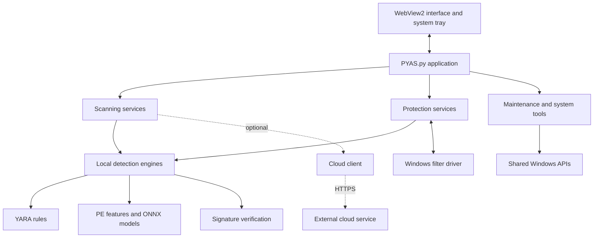

# PYAS Security

<div align="center">

**A hybrid Windows endpoint security platform powered by machine learning, YARA rules, cloud analysis, and kernel-level behavioral protection.**

[](https://github.com/87owo/PYAS/releases/latest)
[](https://github.com/87owo/PYAS/stargazers)
[](https://github.com/87owo/PYAS/network/members)
[](https://github.com/87owo/PYAS)
[](https://www.python.org/)
[](https://github.com/87owo/PYAS/tree/main/Plugins/Filter)

[Website](https://pyas-security.com/antivirus) · [Online Analysis](https://pyas-security.com/analyze) · [Download](https://github.com/87owo/PYAS/releases) · [Report an Issue](https://github.com/87owo/PYAS/issues)

</div>


## Overview

PYAS Security is a source-available Windows endpoint security project that combines multiple detection and protection layers in one desktop application. It brings together local PE-file machine-learning inference, YARA-based matching, digital-signature inspection, optional cloud analysis, real-time user-mode monitoring, and a native Windows minifilter driver.

The project is designed both as a usable security application and as an engineering platform for studying malware detection, Windows internals, rule-driven prevention, model training, and online file analysis.

> [!IMPORTANT]
> PYAS is an independent security project. No antivirus product can guarantee detection of every threat. Evaluate it in a controlled environment before production use, keep backups, and review alerts before deleting files.

## Why PYAS

- **Layered detection** — combines YARA, PE feature analysis, ONNX models, signature verification, and cloud-assisted analysis.
- **Behavior-oriented protection** — monitors processes, files, memory, network activity, system settings, and sensitive operations.
- **Kernel integration** — includes a C++ minifilter driver with configurable protection rules and user-mode communication.
- **Local-first scanning** — performs core static analysis on the endpoint; cloud submission is separately configurable.
- **Operational tooling** — adds quarantine, allow/block lists, system repair, startup management, cleanup, and activity reporting.
- **Research-ready codebase** — includes model-training utilities, detection engines, and a visual rule editor.

## Protection capabilities

| Layer | Capability | Implementation |
|---|---|---|
| Static rules | File and process-memory matching | YARA rules compiled and loaded by `rule_scanner` |
| PE machine learning | Feature extraction and local classification | `pefile`, NumPy, ONNX Runtime |
| Signature trust | Authenticode verification | Windows WinVerifyTrust APIs |
| Cloud integration | Optional file submission and online analysis | Desktop HTTPS client; externally hosted service |
| Process protection | New-process inspection, optional suspension, termination controls | Win32/NT APIs and worker pools |
| File protection | Directory change monitoring, debounced real-time scans, file locking | Windows file notification APIs |
| Memory protection | Process-memory YARA scanning and kernel callbacks | User-mode scanner plus driver rules |
| Network visibility | Process-aware TCP connection monitoring | Windows IP Helper APIs |
| Kernel enforcement | File, process/thread, registry, memory, image-load, and boot/disk controls | Native C++ minifilter driver |
| Recovery and maintenance | Quarantine, system repair, startup management, cleanup, MBR backup/check | Python application services |

Protection modules are individually configurable. Review the available controls and enable those appropriate for your environment.

## System architecture

The desktop application separates presentation, application services, detection engines, and Windows integration. Shared modules handle configuration, logging, storage, and scheduling.


```mermaid
flowchart TB
    UI[WebView2 interface and system tray] <--> APP[PYAS.py application]
    APP --> SCAN[Scanning services]
    APP --> PROTECT[Protection services]
    APP --> TOOLS[Maintenance and system tools]
    SCAN --> ENGINE[Local detection engines]
    PROTECT --> ENGINE
    ENGINE --> YARA[YARA rules]
    ENGINE --> PE[PE features and ONNX models]
    ENGINE --> SIGN[Signature verification]
    PROTECT <--> DRIVER[Windows filter driver]
    TOOLS --> WIN[Shared Windows APIs]
    SCAN -. optional .-> CLIENT[Cloud client]
    CLIENT -. HTTPS .-> SERVICE[External cloud service]
```

The public source contains the desktop cloud client. Cloud server implementation and deployment code are not included in the public repository.

## Repository layout

```text
PYAS/
├── PYAS.py                  # Desktop entry point and UI bridge
├── PYAS_Startup.py          # Application startup
├── PYAS_Runtime.py          # Runtime state and lifecycle
├── PYAS_Config.py           # Configuration management
├── PYAS_Logs.py             # Activity records and export
├── PYAS_Diagnostics.py      # Exception and diagnostic reporting
├── PYAS_Storage.py          # Shared file storage
├── PYAS_Scheduler.py        # Task scheduling
├── PYAS_WinAPI.py           # Shared Windows APIs
├── PYAS_Scanner.py          # Scan workers, results and remediation
├── PYAS_Engine.py           # Detection engine integration
├── PYAS_Rules.py            # YARA rule scanning
├── PYAS_PE.py               # PE model inference
├── PYAS_Features.py         # PE feature extraction
├── PYAS_Signature.py        # Digital signature verification
├── PYAS_Cloud.py            # Cloud client and submission queue
├── PYAS_Protect.py          # Protection service integration
├── PYAS_Realtime.py         # Real-time monitoring
├── PYAS_Driver.py           # Driver lifecycle and communication
├── PYAS_System.py           # System protection controls
├── PYAS_Popup.py            # Popup selection and blocking
├── PYAS_Tools.py            # Tool service integration
├── PYAS_Autostart.py        # Startup management
├── PYAS_Process.py          # Process and network tools
├── PYAS_Maintenance.py      # Cleanup and repair tools
├── PYAS_Threats.py          # Quarantine and threat management
├── PYAS_Version.py          # Executable version metadata
├── Engine/
│   ├── Heuristic/           # YARA rules and assets
│   └── Properties/          # Models and training utilities
├── Interface/              # HTML, CSS, JavaScript and icons
├── Install/                # Installer source
├── tests/                  # Regression tests
└── Plugins/
    ├── Filter/             # Native Windows driver components
    └── Rules/              # Driver protection policies
```

## Getting started

### Option 1 — Install a packaged release

For most users, download the latest installer from [GitHub Releases](https://github.com/87owo/PYAS/releases).

1. Confirm that the installer comes from the official `87owo/PYAS` repository.
2. Ensure Microsoft Visual C++ Redistributable and Microsoft Edge WebView2 Runtime are installed.
3. Run the installer as an administrator.
4. Open PYAS and review the protection switches before enabling kernel-level controls.

### Option 2 — Run from source

Use a Python environment compatible with the desktop dependencies.

```powershell
git clone https://github.com/87owo/PYAS.git
cd PYAS
python -m venv .venv
.\.venv\Scripts\Activate.ps1
python -m pip install --upgrade pip
pip install pystray pefile requests pywebview Pillow yara-python numpy onnxruntime
python PYAS.py
```

Administrator privileges are required for features that interact with protected processes, system configuration, services, physical disks, or the kernel driver. Running the desktop UI without elevation may leave those capabilities unavailable.

### Optional training dependencies

The following packages are used by model-training or data-preparation utilities and are not required for the normal desktop runtime:

```powershell
pip install pandas scikit-learn lightgbm onnxmltools orjson
```

## Runtime requirements

- Windows 10 (May 2020 Update or newer) or Windows 11
- 64-bit Windows for the included x64 driver
- Microsoft Visual C++ Redistributable
- Microsoft Edge WebView2 Runtime
- Administrator privileges for full protection and system maintenance

Resource usage depends on scan scope, file sizes, enabled engines, and protection settings.

## Command-line integration

The application supports Windows shell and maintenance workflows through command-line arguments:

```text
PYAS.exe -scan <path>         Scan a file or directory, forwarding to an existing instance
PYAS.exe -hide                Start with the main window hidden
PYAS.exe -quit                Request the running instance to exit
PYAS.exe -driver-unload       Unload the active filter driver
PYAS.exe -driver-uninstall    Stop and remove the driver service
```

These commands are primarily intended for installer, shell-menu, and maintenance integration. Administrative rights may be required.

## Configuration and local data

PYAS stores machine-wide configuration and reports under:

```text
%ProgramData%\PYAS\Config.json
%ProgramData%\PYAS\Report.json
```

WebView2 user data is stored under the current user's local application-data directory. Activity records and diagnostic errors use the shared report system. Configuration includes protection settings, interface preferences, rule references, allow/block lists, and quarantine metadata.

Before reporting a configuration issue, reproduce it with default settings when safe to do so and remove sensitive paths or file information from logs.

## Building the driver

Native Windows driver components are located in `Plugins/Filter/`.

Typical prerequisites:

- Visual Studio with Desktop development with C++;
- a compatible Windows Driver Kit (WDK);
- an x64 build environment;
- an appropriate test-signing or production code-signing workflow.

Build and test kernel components only in an isolated virtual machine with snapshots. Windows driver loading policies apply, and production distribution requires appropriate signing. Do not disable platform security controls on a primary workstation merely to load a development build.

## Rule editor

PYAS includes a Blockly-based visual editor for creating driver protection rules. The packaged editor is distributed through project releases.


Driver rules support matching across categories such as file, process, thread, registry, memory, device, and image-load activity, with allow/deny behavior, priority, operation masks, path relationships, thresholds, and other contextual constraints.

## Machine-learning engine

The local PE engine extracts structural and statistical characteristics from Windows executables, including headers, sections, data directories, imports, exports, resources, strings, byte distributions, entropy windows, overlay data, Rich headers, load configuration, certificates, and entry-point anomalies. Features are ordered according to the model metadata and evaluated through ONNX Runtime.


Model performance shown by training output should not be interpreted as a universal real-world detection rate. Reproducible evaluation requires a documented dataset split, class balance, deduplication strategy, temporal holdout, false-positive analysis, and testing against previously unseen malware families.

## Security and privacy

- Cloud scanning is optional; review the active configuration before analyzing confidential files.
- Kernel drivers and remediation features can affect system stability and data availability.
- Quarantine, deletion, startup changes, system repair, and MBR operations should be tested with recoverable data.
- If you discover a vulnerability, avoid publishing exploit details before the maintainer has had a reasonable opportunity to respond.

## Contributing

Issues and focused pull requests are welcome.

- Search [existing issues](https://github.com/87owo/PYAS/issues) before opening a new report.
- Include reproducible steps, expected and actual behavior, logs with sensitive data removed, and environment details.
- Keep unrelated refactors out of bug-fix pull requests.
- Do not commit malware samples, credentials, tokens, private certificates, or machine-specific build output.

## License and third-party components

Review the applicable component licenses and bundled third-party asset terms before redistribution, commercial use, or incorporation into another product. Contact the maintainer if the permitted use is unclear.

## Links and contact

- Source: [github.com/87owo/PYAS](https://github.com/87owo/PYAS)
- Releases: [github.com/87owo/PYAS/releases](https://github.com/87owo/PYAS/releases)
- Official website: [pyas-security.com/antivirus](https://pyas-security.com/antivirus)
- Online analysis: [pyas-security.com/analyze](https://pyas-security.com/analyze)
- Issue tracker: [github.com/87owo/PYAS/issues](https://github.com/87owo/PYAS/issues)
- Email: [service@pyas-security.com](mailto:service@pyas-security.com)

---

<div align="center">

Built for Windows security research, layered endpoint defense, and transparent experimentation.

</div>
